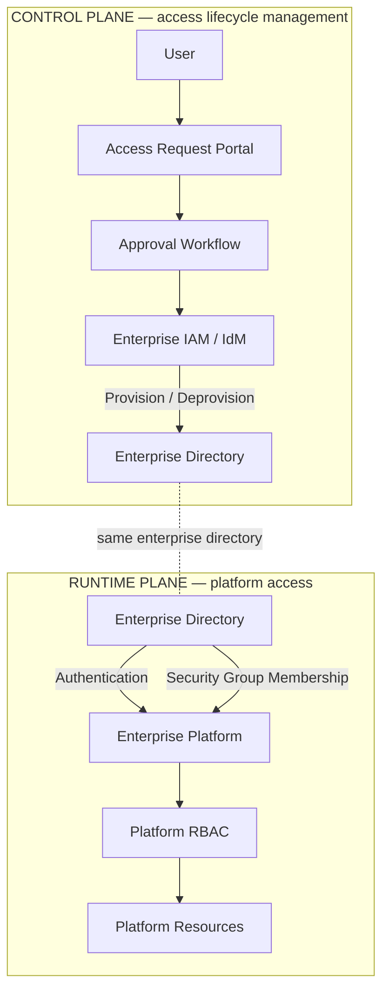
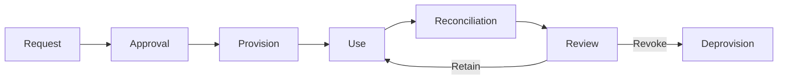
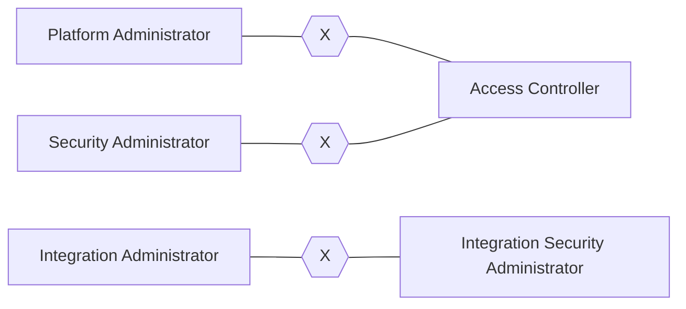
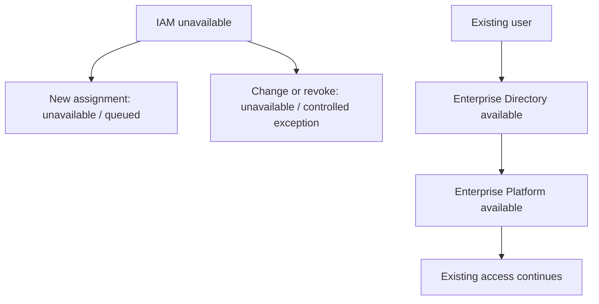

# Centralized IAM Integration for an Enterprise Platform

**Architecture case study for integrating Enterprise IAM / IdM, an enterprise directory, and application RBAC**

[Русская версия](README.md)

> A synthetic public architecture case based on practical experience designing centralized access management for an enterprise platform. All names, roles, systems, groups, and data in this repository are fictional and created specifically for the portfolio.

## Executive summary

An enterprise platform has its own RBAC model, while access lifecycle must be governed centrally through request, approval, provisioning, revocation, and periodic reconciliation.

The architectural problem is not simply to “connect the application to IAM.” It is to separate four responsibilities:

- **authentication** of the user;
- **authorization** inside the platform;
- access **provisioning / deprovisioning**;
- **governance** — approval, segregation of duties, audit, and reconciliation.

Core principle:

> **IAM manages access state but does not become a mandatory runtime dependency of the business platform.**

This reduces coupling: an IAM outage can temporarily stop new access assignments and revocations, but should not automatically block existing users while the enterprise directory and platform remain available.

## My role

**Solution Architect / Author of the Technical Solution**

Responsibilities represented in the case:

- architecture of centralized access-management integration;
- separation of control plane and runtime plane;
- mapping between directory groups and application roles;
- access request and revocation lifecycle;
- Segregation of Duties (SoD) rules;
- failure behavior when IAM is unavailable;
- access reconciliation and governance controls;
- architecture acceptance criteria.

The public origin and authorship boundary is documented in [ORIGIN.md](ORIGIN.md).

## 1. Control Plane vs Runtime Plane



**Architecture boundary:** IAM changes user membership in enterprise-directory security groups. The platform interprets those groups as roles. Direct runtime communication `Platform → IAM` is not required.

## 2. Access model

```text
Authentication
User → Enterprise Directory → Enterprise Platform

Authorization
Directory Group → Platform Role → Permissions

Provisioning
Access Request → Approval → IAM → Directory Group Membership

Deprovisioning
IAM → Remove Group Membership → Access Revoked

Governance
Role Catalogue → SoD Rules → Reconciliation → Review
```

## 3. Directory-group to role mapping


Synthetic example:

| Directory Group | Platform Role | Environment | Purpose |
|---|---|---|---|
| PLT-PRD-OPS | Platform Operator | PROD | operational administration |
| PLT-PRD-SEC | Security Administrator | PROD | security administration |
| PLT-PRD-AUD | Access Controller | PROD | access review and audit |
| PLT-PRD-INT | Integration Administrator | PROD | integration configuration |
| PLT-TST-OPS | Platform Operator | TEST | test operations |
| PLT-TST-TESTER | Tester | TEST | functional testing |

See [data/role-catalog.csv](data/role-catalog.csv).

## 4. Access lifecycle



## 5. Segregation of Duties



Synthetic conflict matrix: [data/sod-matrix.csv](data/sod-matrix.csv).

## 6. IAM failure behavior



IAM belongs to the **control plane**, so its failure should not unnecessarily propagate to the runtime business platform.

## 7. Reconciliation

```text
Approved Entitlements
        │
        ▼
Expected Directory Membership
        │
        ▼
Actual Directory Membership
        │
        ▼
Resolved Platform Roles
        │
        ▼
Reconciliation Result
   MATCH / DRIFT / ORPHAN
```

## Architecture decisions

- [ADR-001 — Directory Groups as the Authorization Boundary](decisions/ADR-001-directory-groups-as-authorization-boundary.md)
- [ADR-002 — No Direct Runtime Dependency on IAM](decisions/ADR-002-no-runtime-dependency-on-iam.md)
- [ADR-003 — Workflow-Governed Access Provisioning](decisions/ADR-003-workflow-governed-provisioning.md)
- [ADR-004 — Environment-Specific Role Catalogues](decisions/ADR-004-environment-specific-role-catalogues.md)
- [ADR-005 — Segregation of Duties and Reconciliation](decisions/ADR-005-sod-and-reconciliation.md)

## Repository map

| Area | Content |
|---|---|
| [Context & Drivers](docs/context-and-drivers.md) | problem, constraints, architecture drivers |
| [Architecture](docs/architecture.md) | control plane, runtime plane and integration boundaries |
| [Access Lifecycle](docs/access-lifecycle.md) | request → approval → provision → review → revoke |
| [Role Governance](docs/role-governance.md) | role catalogue, mapping and SoD |
| [Resilience & Controls](docs/resilience-and-controls.md) | IAM outages, exceptions and reconciliation |
| [Lessons Learned](docs/lessons-learned.md) | generalized architecture lessons |
| [Architecture Decisions](decisions/) | five ADRs |
| [Synthetic Data](data/) | fictional role mapping, SoD and request examples |
| [Governance](governance/) | checklists and reconciliation controls |
| [Architecture Sources](architecture/) | Mermaid diagram sources |

## Disclaimer

**This repository contains only synthetic, newly created portfolio material.**

It contains no corporate documents, original diagrams, employer or customer names, internal system identifiers, domains, accounts, network parameters, real security groups, or operational instructions. The public architecture is an independent reconstruction of professional experience.