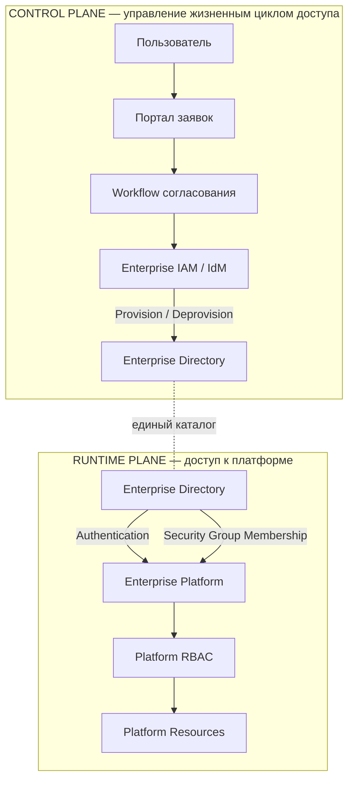
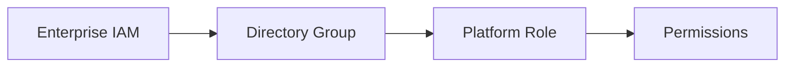
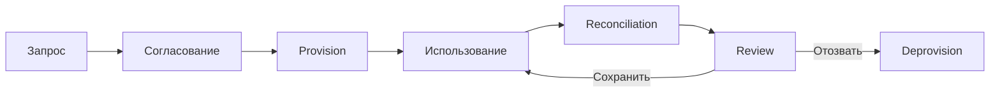
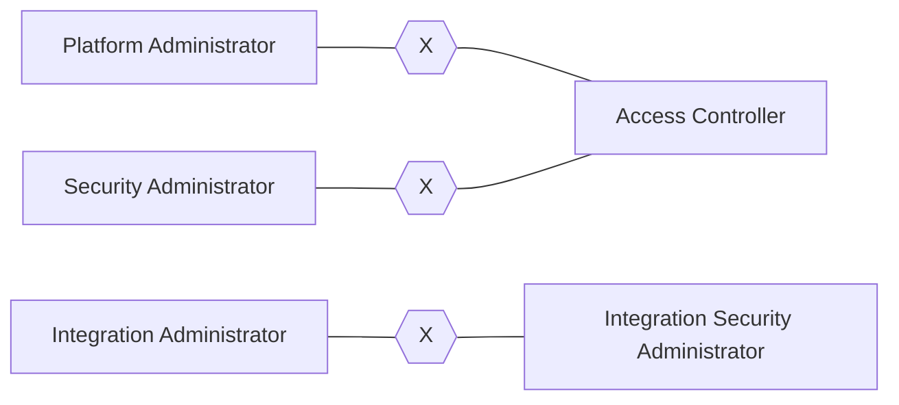
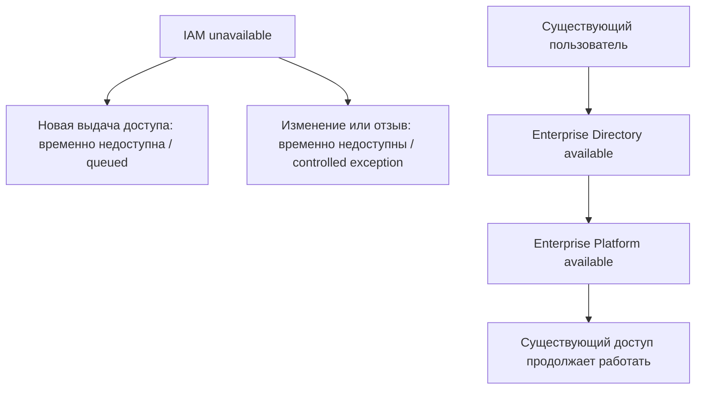

# Централизованное управление доступом к корпоративной платформе

**Архитектурный кейс интеграции Enterprise IAM / IdM, корпоративного каталога и RBAC прикладной платформы**

[English version](README.en.md)

> Синтетический публичный кейс, основанный на практическом опыте проектирования интеграции корпоративной платформы с централизованным контуром управления доступом. Все названия, роли, системы, группы и данные в репозитории вымышлены и созданы специально для портфолио.

## Кратко о кейсе

Корпоративная платформа имеет собственную ролевую модель, но жизненный цикл доступа должен управляться централизованно: через заявку, согласование, выдачу, отзыв и периодическую сверку прав.

Архитектурная задача состоит не в том, чтобы «подключить приложение к IAM», а в том, чтобы разделить ответственность между четырьмя механизмами:

- **аутентификацией** пользователя;
- **авторизацией** внутри платформы;
- **provisioning / deprovisioning** доступа;
- **governance** — согласованием, разделением полномочий, аудитом и сверкой.

Ключевой принцип:

> **IAM управляет состоянием доступа, но не становится обязательной runtime-зависимостью прикладной платформы.**

Это снижает связанность: недоступность IAM может временно остановить новые назначения и отзывы прав, но не должна автоматически блокировать уже работающих пользователей, если корпоративный каталог и сама платформа доступны.

## Моя роль

**Solution Architect / Author of the Technical Solution**

В кейсе отражены зоны ответственности:

- проектирование интеграции платформы с централизованным управлением доступом;
- разделение control plane и runtime plane;
- модель сопоставления групп каталога и прикладных ролей;
- проектирование процесса выдачи и отзыва доступа;
- правила разделения полномочий (Segregation of Duties, SoD);
- требования к работе при недоступности IAM;
- контроль и сверка фактически выданных прав;
- критерии приемки архитектуры управления доступом.

Граница происхождения и авторства публичного материала описана в [ORIGIN.md](ORIGIN.md).

## Архитектурная задача

Платформа должна использовать единый корпоративный контур идентификации и управления доступом, при этом:

- IAM не должен участвовать в каждой пользовательской операции;
- роли платформы должны назначаться централизованно;
- бизнес-приложение не должно самостоятельно хранить отдельный реестр корпоративных учетных записей;
- выдача доступа должна проходить управляемый процесс согласования;
- TEST и PROD должны иметь независимые границы доступа;
- конфликтующие роли должны контролироваться;
- фактические назначения должны поддаваться аудиту и сверке;
- отказ IAM не должен превращаться в отказ самой бизнес-платформы.

## 1. Разделение Control Plane и Runtime Plane



**Архитектурная граница:** IAM изменяет членство пользователя в группах корпоративного каталога. Платформа интерпретирует эти группы как роли. Прямое runtime-взаимодействие `Platform → IAM` не требуется.

Подробнее: [Architecture](docs/architecture.md).

## 2. Модель доступа

```text
Authentication
User → Enterprise Directory → Enterprise Platform

Authorization
Directory Group → Platform Role → Permissions

Provisioning
Access Request → Approval → IAM → Directory Group Membership

Deprovisioning
IAM → Remove Group Membership → Access Revoked

Governance
Role Catalogue → SoD Rules → Reconciliation → Review
```

Такое разделение не позволяет смешать «кто пользователь», «что ему разрешено», «кто и как назначил право» и «как подтверждается корректность фактического состояния».

## 3. Сопоставление групп и ролей

Платформа не получает произвольный набор прав непосредственно из IAM. Используется устойчивый контракт:



Пример синтетического каталога:

| Directory Group | Platform Role | Environment | Назначение |
|---|---|---|---|
| PLT-PRD-OPS | Platform Operator | PROD | эксплуатационные операции |
| PLT-PRD-SEC | Security Administrator | PROD | управление параметрами ИБ |
| PLT-PRD-AUD | Access Controller | PROD | контроль назначений и аудит |
| PLT-PRD-INT | Integration Administrator | PROD | управление интеграционными настройками |
| PLT-TST-OPS | Platform Operator | TEST | тестовая эксплуатация |
| PLT-TST-TESTER | Tester | TEST | функциональное тестирование |

Полный синтетический пример: [data/role-catalog.csv](data/role-catalog.csv).

## 4. Жизненный цикл доступа



Принципиально важны две вещи:

1. выдача доступа — это управляемое изменение состояния, а не ручная настройка в приложении;
2. после выдачи доступ должен оставаться проверяемым и отзываться централизованно.

Подробнее: [Access Lifecycle](docs/access-lifecycle.md).

## 5. Segregation of Duties

Некоторые административные полномочия нельзя совмещать у одного пользователя. Например, роль, которая изменяет доступ, не должна одновременно быть единственным независимым контролером этого доступа.



Синтетическая матрица конфликтов: [data/sod-matrix.csv](data/sod-matrix.csv).

## 6. Поведение при отказе IAM



IAM относится к **control plane**, поэтому его отказ не должен без необходимости распространяться на runtime-доступ пользователей. При этом изменения прав во время отказа должны быть ограничены и контролироваться отдельной процедурой.

Подробнее: [Resilience & Controls](docs/resilience-and-controls.md).

## 7. Сверка прав

Целевое состояние периодически сравнивается с фактическим:

```text
Approved Entitlements
        │
        ▼
Expected Directory Membership
        │
        ▼
Actual Directory Membership
        │
        ▼
Resolved Platform Roles
        │
        ▼
Reconciliation Result
   MATCH / DRIFT / ORPHAN
```

Это закрывает риск ручного или ошибочного изменения прав вне управляемого процесса.

## Ключевые архитектурные решения

- [ADR-001 — Directory Groups as the Authorization Boundary](decisions/ADR-001-directory-groups-as-authorization-boundary.md)
- [ADR-002 — No Direct Runtime Dependency on IAM](decisions/ADR-002-no-runtime-dependency-on-iam.md)
- [ADR-003 — Workflow-Governed Access Provisioning](decisions/ADR-003-workflow-governed-provisioning.md)
- [ADR-004 — Environment-Specific Role Catalogues](decisions/ADR-004-environment-specific-role-catalogues.md)
- [ADR-005 — Segregation of Duties and Reconciliation](decisions/ADR-005-sod-and-reconciliation.md)

## Навигация по репозиторию

| Раздел | Содержание |
|---|---|
| [Context & Drivers](docs/context-and-drivers.md) | проблема, ограничения и драйверы |
| [Architecture](docs/architecture.md) | control plane, runtime plane и границы интеграции |
| [Access Lifecycle](docs/access-lifecycle.md) | request → approval → provision → review → revoke |
| [Role Governance](docs/role-governance.md) | role catalogue, mapping и SoD |
| [Resilience & Controls](docs/resilience-and-controls.md) | отказ IAM, исключения и reconciliation |
| [Lessons Learned](docs/lessons-learned.md) | обобщенные архитектурные выводы |
| [Architecture Decisions](decisions/) | пять ADR |
| [Synthetic Data](data/) | вымышленные role mapping, SoD и access request examples |
| [Governance](governance/) | checklist и правила сверки |
| [Architecture Sources](architecture/) | Mermaid-исходники диаграмм |

## Что демонстрирует кейс

Кейс показывает, как спроектировать IAM-интеграцию так, чтобы:

- централизовать жизненный цикл доступа без жесткой runtime-связности;
- отделить authentication от authorization и provisioning;
- использовать группы корпоративного каталога как стабильную границу между IAM и приложением;
- управлять правами через каталог ролей и процесс согласования;
- разделять TEST/PROD entitlement space;
- применять SoD к административным ролям;
- обнаруживать drift через регулярную сверку;
- сохранять доступность прикладной платформы при отказе control-plane-компонента.

## Дисклеймер

**Репозиторий содержит только синтетические и заново созданные материалы портфолио.**

В нем нет корпоративных документов, оригинальных диаграмм, имен работодателя или заказчика, внутренних системных идентификаторов, доменов, учетных записей, сетевых параметров, реальных групп доступа или эксплуатационных инструкций. Архитектурная модель публичного кейса является независимой реконструкцией профессионального опыта.