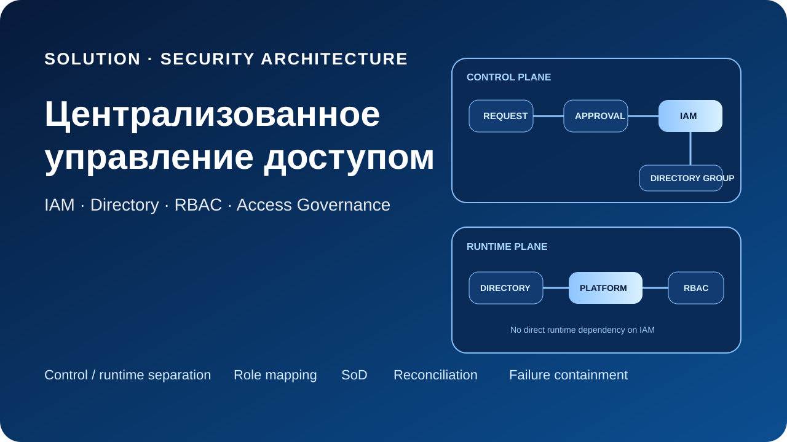
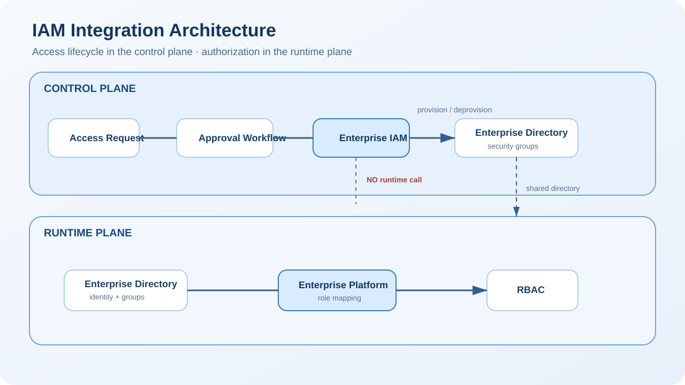
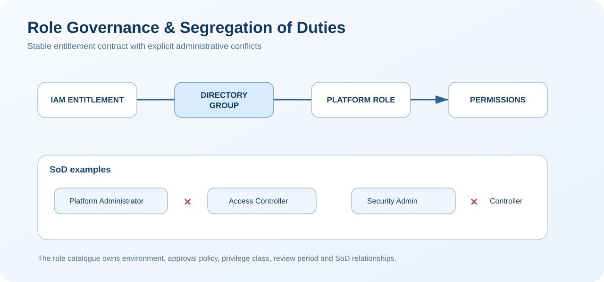
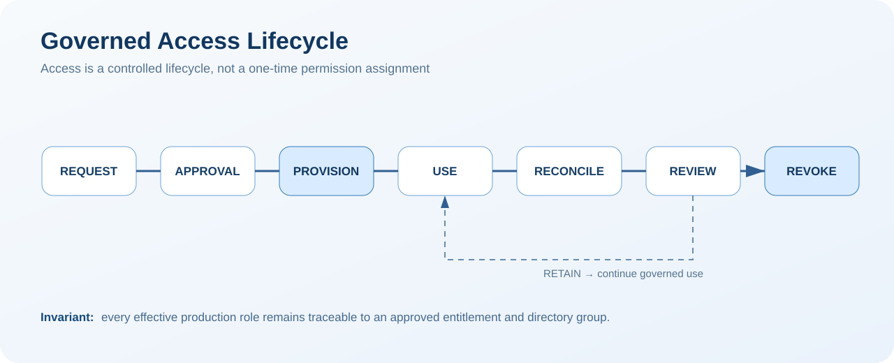
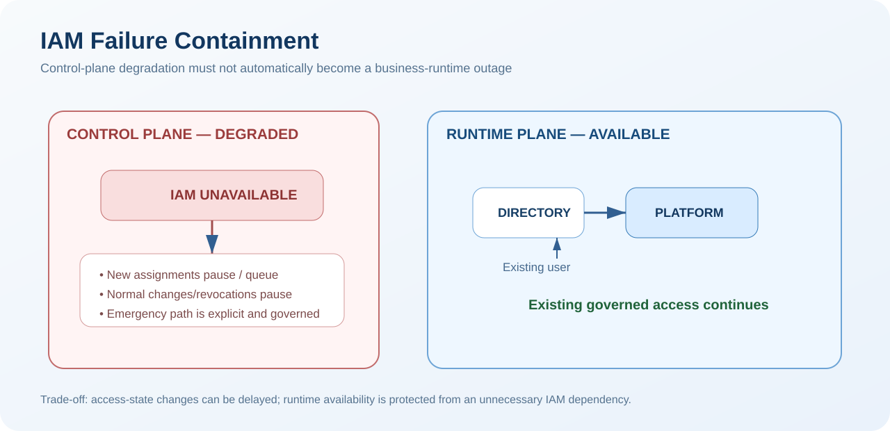

# Централизованное управление доступом к корпоративной платформе

**Архитектурный кейс интеграции Enterprise IAM / IdM, корпоративного каталога и RBAC прикладной платформы**

[English version](README.en.md)



> Синтетический публичный кейс, основанный на практическом опыте проектирования интеграции корпоративной платформы с централизованным контуром управления доступом. Все названия, роли, системы, группы и данные в репозитории вымышлены и созданы специально для портфолио.

## Кратко о кейсе

Корпоративная платформа имеет собственную ролевую модель, но жизненный цикл доступа должен управляться централизованно: через заявку, согласование, выдачу, отзыв и периодическую сверку прав.

Архитектурная задача состоит не в том, чтобы просто «подключить приложение к IAM», а в том, чтобы разделить ответственность между **аутентификацией**, **авторизацией**, **provisioning/deprovisioning** и **access governance**.

Ключевой принцип:

> **IAM управляет состоянием доступа, но не становится обязательной runtime-зависимостью прикладной платформы.**

Недоступность IAM может временно остановить новые назначения и отзывы прав, но не должна автоматически блокировать уже работающих пользователей, если корпоративный каталог и сама платформа доступны.

## Моя роль

**Solution Architect / Author of the Technical Solution**

В кейсе отражены следующие зоны ответственности:

- проектирование интеграции платформы с централизованным управлением доступом;
- разделение control plane и runtime plane;
- модель сопоставления групп каталога и прикладных ролей;
- проектирование процесса выдачи и отзыва доступа;
- правила Segregation of Duties (SoD);
- требования к работе при недоступности IAM;
- контроль и сверка фактически выданных прав;
- критерии приемки архитектуры управления доступом.

Граница происхождения и авторства материала описана в [ORIGIN.md](ORIGIN.md).

## Архитектурная задача

Целевая модель должна одновременно обеспечить централизованное управление жизненным циклом доступа и не превратить IAM в критическую runtime-зависимость. Дополнительные требования: отдельные пространства прав TEST/PROD, контролируемые конфликтующие роли, аудит назначений, сверка фактического состояния и управляемый режим деградации.

## 1. Control Plane и Runtime Plane



**Control plane:** заявка → согласование → IAM → изменение членства в группе корпоративного каталога.

**Runtime plane:** пользователь → корпоративный каталог → корпоративная платформа → RBAC.

Архитектурная граница проходит через **directory security group**. IAM управляет членством пользователя в группе, а платформа сопоставляет группу своей роли. Прямое runtime-взаимодействие `Platform → IAM` не требуется.

Подробнее: [Architecture](docs/architecture.md).

## 2. Модель доступа

```text
Authentication
User → Enterprise Directory → Enterprise Platform

Authorization
Directory Group → Platform Role → Permissions

Provisioning
Access Request → Approval → IAM → Directory Group Membership

Deprovisioning
IAM → Remove Group Membership → Access Revoked

Governance
Role Catalogue → SoD Rules → Reconciliation → Review
```

Такое разделение не позволяет смешать «кто пользователь», «что ему разрешено», «кто и как назначил право» и «как подтверждается корректность фактического состояния».

## 3. Role Governance и Segregation of Duties



Платформа не получает произвольный набор низкоуровневых прав непосредственно из IAM. Используется устойчивый контракт:

```text
IAM Entitlement → Directory Group → Platform Role → Permissions
```

Пример синтетического каталога:

| Directory Group | Platform Role | Environment | Назначение |
|---|---|---|---|
| PLT-PRD-OPS | Platform Operator | PROD | эксплуатационные операции |
| PLT-PRD-SEC | Security Administrator | PROD | управление параметрами ИБ |
| PLT-PRD-AUD | Access Controller | PROD | контроль назначений и аудит |
| PLT-PRD-INT | Integration Administrator | PROD | управление интеграционными настройками |
| PLT-TST-OPS | Platform Operator | TEST | тестовая эксплуатация |
| PLT-TST-TESTER | Tester | TEST | функциональное тестирование |

Некоторые административные полномочия несовместимы. Например, субъект, изменяющий доступ, не должен одновременно выступать единственным независимым контролером собственных назначений.

Синтетические данные: [role catalogue](data/role-catalog.csv) · [SoD matrix](data/sod-matrix.csv) · [access requests](data/access-request-examples.csv).

Подробнее: [Role Governance](docs/role-governance.md).

## 4. Жизненный цикл доступа



Выдача доступа рассматривается как управляемый жизненный цикл:

**Request → Approval → Provision → Use → Reconciliation → Review → Revoke/Retain**.

После выдачи право не становится «вечным»: оно остается трассируемым до исходного entitlement, может пересматриваться и централизованно отзываться.

Подробнее: [Access Lifecycle](docs/access-lifecycle.md).

## 5. Поведение при отказе IAM



IAM относится к **control plane**, поэтому его отказ не должен без необходимости распространяться на runtime-доступ пользователей.

При недоступности IAM:

- нормальная выдача, изменение и отзыв прав временно деградируют;
- существующий пользователь продолжает работать, если каталог и платформа доступны;
- аварийные изменения допускаются только как контролируемое исключение;
- после восстановления IAM исключительные изменения обязательно попадают в reconciliation.

Это сознательный trade-off: доступность runtime повышается ценой возможной задержки изменения access state во время отказа control plane.

Подробнее: [Resilience & Controls](docs/resilience-and-controls.md).

## 6. Сверка фактических прав

Целевое состояние периодически сравнивается с фактическим:

```text
Approved Entitlements
        │
        ▼
Expected Directory Membership
        │
        ▼ compare
Actual Directory Membership
        │
        ▼
Resolved Platform Roles
        │
        ▼
MATCH / MISSING / DRIFT / ORPHAN / CONFLICT
```

Сверка закрывает риск ручного изменения групп, неполного отзыва доступа, ошибок provisioning и «осиротевших» связей между группами и ролями.

Подробнее: [Reconciliation Model](governance/reconciliation-model.md).

## Ключевые архитектурные решения

- [ADR-001 — Directory Groups as the Authorization Boundary](decisions/ADR-001-directory-groups-as-authorization-boundary.md)
- [ADR-002 — No Direct Runtime Dependency on IAM](decisions/ADR-002-no-runtime-dependency-on-iam.md)
- [ADR-003 — Workflow-Governed Access Provisioning](decisions/ADR-003-workflow-governed-provisioning.md)
- [ADR-004 — Environment-Specific Role Catalogues](decisions/ADR-004-environment-specific-role-catalogues.md)
- [ADR-005 — Segregation of Duties and Reconciliation](decisions/ADR-005-sod-and-reconciliation.md)

## Навигация по репозиторию

| Раздел | Содержание |
|---|---|
| [Context & Drivers](docs/context-and-drivers.md) | проблема, ограничения и архитектурные драйверы |
| [Architecture](docs/architecture.md) | control plane, runtime plane и границы интеграции |
| [Access Lifecycle](docs/access-lifecycle.md) | request → approval → provision → review → revoke |
| [Role Governance](docs/role-governance.md) | role catalogue, mapping и SoD |
| [Resilience & Controls](docs/resilience-and-controls.md) | отказ IAM, исключения и reconciliation |
| [Lessons Learned](docs/lessons-learned.md) | обобщенные архитектурные выводы |
| [Architecture Decisions](decisions/) | пять ADR |
| [Synthetic Data](data/) | вымышленные role mapping, SoD и access request examples |
| [Governance](governance/) | checklist и модель сверки |
| [Architecture Sources](architecture/) | Mermaid-исходники диаграмм |

## Что демонстрирует кейс

Кейс показывает, как:

- централизовать жизненный цикл доступа без жесткой runtime-связности;
- отделить authentication от authorization и provisioning;
- использовать группы корпоративного каталога как стабильную границу между IAM и приложением;
- управлять правами через каталог ролей и процесс согласования;
- разделять TEST/PROD entitlement space;
- применять SoD к административным ролям;
- обнаруживать drift через регулярную сверку;
- сохранять доступность прикладной платформы при отказе control-plane-компонента.

## Дисклеймер

**Репозиторий содержит только синтетические и заново созданные материалы портфолио.**

В нем нет корпоративных документов, оригинальных диаграмм, имен работодателя или заказчика, внутренних системных идентификаторов, доменов, учетных записей, сетевых параметров, реальных групп доступа или эксплуатационных инструкций. Архитектурная модель публичного кейса является независимой реконструкцией профессионального опыта.