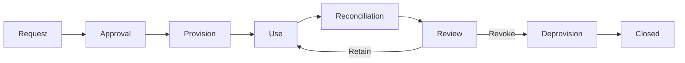

# Access lifecycle

## Lifecycle overview

Access is modeled as a governed lifecycle rather than a one-time technical assignment.



## 1. Request

A request identifies:

- target platform;
- requested role/entitlement;
- target environment;
- requester and beneficiary;
- business justification;
- requested validity period where applicable.

The request must use a governed role catalogue rather than free-form permission text.

## 2. Approval

Approval policy is derived from the requested entitlement. A synthetic example can include:

- line-manager approval;
- application-owner approval for privileged roles;
- security approval for security-sensitive roles;
- SoD validation before provisioning.

The exact organizational titles are intentionally not modeled in the public case.

## 3. Provisioning

After approval, IAM maps the entitlement to a directory security group and changes membership.

```text
Approved entitlement
      │
      ▼
IAM provisioning rule
      │
      ▼
Directory group membership
```

Provisioning success must be auditable.

## 4. Runtime use

The user authenticates through enterprise identity infrastructure. The platform resolves current directory-group membership and maps it to roles.

IAM is not called in the runtime path.

## 5. Review

Access should be periodically reviewable. A reviewer confirms one of the following outcomes:

- **retain** — entitlement remains justified;
- **change** — role or scope must be adjusted;
- **revoke** — access is no longer required;
- **investigate** — actual state does not match approved state.

## 6. Deprovisioning

Revocation removes the directory-group membership associated with the entitlement.

The architecture must define the expected revocation latency. The public case deliberately leaves the exact session invalidation behavior to application policy.

## Exceptional changes

Emergency access or manual directory changes are possible only as controlled exceptions. They should be:

1. time-bounded where possible;
2. logged with an accountable initiator;
3. independently reviewed;
4. reconciled back into the governed access model.

An exception is not an alternative normal process.

## Lifecycle invariants

- Every production entitlement maps to a known catalogue item.
- Every governed entitlement has an approval record.
- Every entitlement maps to a known directory group.
- Every directory group used for platform authorization maps to a known platform role.
- Every privileged role has an owner and review rule.
- Revoked entitlements must disappear from expected directory membership.
- Reconciliation must detect unauthorized/manual drift.