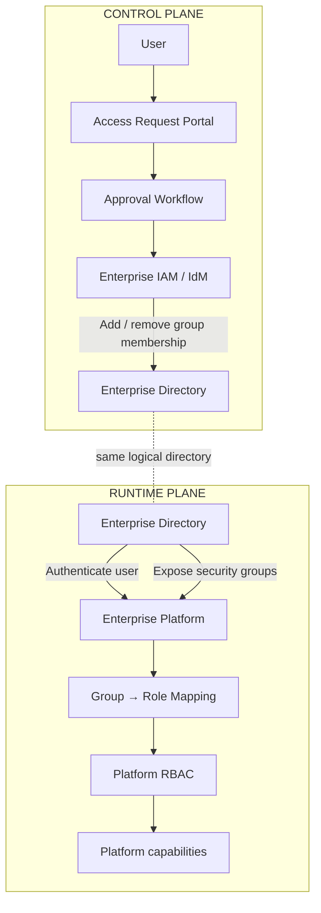
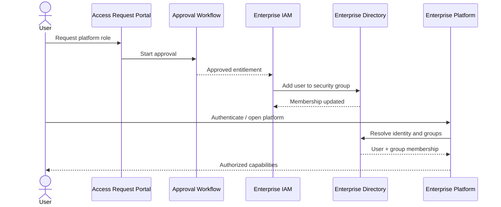

# Architecture

## Architecture principle

The architecture separates two different concerns:

- **Control plane** — where access is requested, approved, provisioned, revoked and reviewed.
- **Runtime plane** — where an already-authorized user authenticates and uses the enterprise platform.

IAM belongs to the control plane. It changes access state but is not consulted for every runtime authorization decision.

## Logical architecture



## Responsibility boundaries

| Component | Owns | Does not own |
|---|---|---|
| Access Request Portal | request capture | platform permissions |
| Approval Workflow | approval state and policy route | actual directory membership |
| IAM / IdM | provisioning and deprovisioning | runtime application authorization |
| Enterprise Directory | identity and security-group membership | platform permission semantics |
| Enterprise Platform | role mapping and application permissions | corporate access request lifecycle |

## Authorization boundary

The stable cross-system contract is the **directory security group**.

```text
IAM Entitlement
      │
      ▼
Directory Security Group
      │
      ▼
Platform Role
      │
      ▼
Application Permissions
```

This creates a useful decoupling:

- IAM does not need to understand every platform permission;
- the platform does not need to implement enterprise approval workflows;
- the directory remains the authoritative runtime source for group membership;
- role-to-permission changes can be made inside the platform without changing IAM integration mechanics, provided the entitlement contract remains valid.

## Authentication

The synthetic case assumes enterprise-directory-backed authentication. The exact authentication protocol is intentionally left vendor-neutral in the public model.

The important architecture property is that the user identity is validated by the enterprise identity infrastructure, not by a separate application-specific credential store.

## Authorization

After authentication, the platform resolves the user's directory-group membership into one or more platform roles.

Authorization is therefore a two-stage mapping:

```text
Directory membership → Platform role → Permissions
```

The platform remains authoritative for the second mapping.

## Provisioning

Provisioning is asynchronous with respect to runtime access:



## Deprovisioning

Revocation follows the same contract in reverse. IAM removes the directory-group membership. On the next effective authorization evaluation, the platform no longer resolves the revoked role.

Depending on platform/session requirements, revocation latency must be explicitly defined. The public case does not prescribe a specific session invalidation mechanism because that belongs to application/security policy, not to the generic integration pattern.

## Environment separation

TEST and PROD are separate entitlement spaces:

```text
PLT-TST-* groups → TEST roles only
PLT-PRD-* groups → PROD roles only
```

A user having a test role does not imply any production entitlement.

## Trust boundaries

The design relies on three explicit trust relationships:

1. the approval process is trusted to produce valid entitlements;
2. IAM is trusted to make requested directory membership changes;
3. the platform is trusted to map directory groups to permissions correctly.

Each boundary has a separate control:

- approval audit trail;
- provisioning audit and reconciliation;
- platform role-mapping review and regression validation.

## What is intentionally not coupled

There is no required direct runtime call:

```text
Enterprise Platform ─X─> IAM
```

This is the key availability and separation-of-concerns decision in the case.