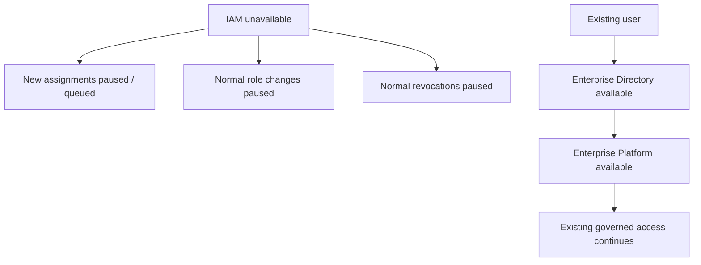
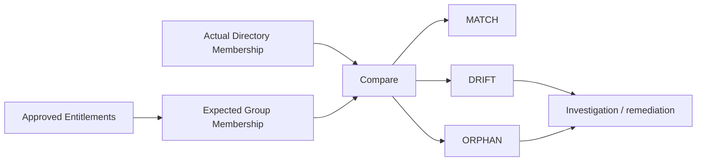

# Resilience and controls

## Failure-domain principle

IAM is a control-plane component. Its unavailability should not automatically become a runtime outage of the enterprise platform.

This behavior is possible because runtime authentication and group resolution use the enterprise directory, not IAM directly.

## Failure scenarios

| Scenario | Expected behavior |
|---|---|
| IAM unavailable, directory healthy | Existing access continues; lifecycle changes pause or use controlled exception process |
| Directory unavailable | Authentication/group resolution is affected; platform access may be unavailable according to platform policy |
| Approval workflow unavailable | New access requests cannot complete; existing runtime access is unaffected |
| Platform unavailable | IAM and directory remain available; provisioning may complete but application use is impossible |
| Mapping configuration incorrect | Reconciliation/test controls detect mismatch between groups and effective roles |

## Controlled exception path

Emergency access changes during IAM outage must not become a parallel unmanaged process.

A valid exception model includes:

1. explicit incident/change reference;
2. authorized initiator;
3. independent approval where feasible;
4. minimum required access;
5. time limit or explicit revalidation point;
6. audit record;
7. mandatory reconciliation after IAM recovery.

## Reconciliation model

Reconciliation compares intended and actual state.

### MATCH

Approved entitlement, expected group membership and actual group membership agree.

### DRIFT

Actual directory membership differs from what approved entitlements predict. Typical causes include manual administration, incomplete revocation or provisioning error.

### ORPHAN

A directory group or role assignment exists without a valid catalogue/entitlement relationship.

## Control evidence

The architecture should support evidence for:

- who requested access;
- which entitlement was requested;
- who approved it;
- what directory change was executed;
- what role became effective;
- when access was reviewed;
- when it was revoked;
- whether reconciliation found drift.

## Mapping validation

Role mapping is configuration with security impact. Changes should be reviewed and validated like application configuration.

Minimum checks:

- every configured directory group exists in the role catalogue;
- every production role points to a production group;
- no unexpected duplicate mappings exist;
- retired roles are removed;
- SoD rules remain valid after role changes.

## Availability trade-off

Separating IAM from runtime improves availability but introduces a deliberate consistency model: access changes may not be instantaneous during a control-plane outage.

That trade-off is acceptable only when:

- existing access is already authorized and auditable;
- emergency revocation has a separately governed path if required by risk policy;
- reconciliation after recovery is mandatory;
- the organization explicitly defines maximum tolerated access-change latency.