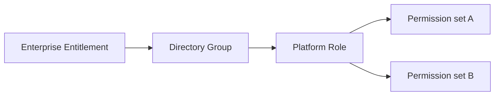

# Role governance

## Role catalogue

The platform role catalogue is the semantic contract between enterprise access management and application authorization.

Each catalogue item should define at least:

- stable role identifier;
- human-readable name;
- target environment;
- business/technical purpose;
- directory-group mapping;
- role owner;
- privilege class;
- approval policy;
- review policy;
- SoD conflicts.

The synthetic example is stored in [../data/role-catalog.csv](../data/role-catalog.csv).

## Mapping model



The external contract ends at the directory group. Platform-internal permissions can evolve without requiring IAM to understand each individual permission.

## Environment boundaries

The role namespace encodes environment ownership:

- `PLT-TST-*` — TEST only;
- `PLT-PRD-*` — PROD only.

Environment separation prevents accidental promotion of a user's test entitlement into production access.

## Segregation of Duties

SoD prevents a single identity from accumulating conflicting powers.

Synthetic examples:

| Role A | Role B | Policy |
|---|---|---|
| Platform Administrator | Access Controller | DENY |
| Security Administrator | Access Controller | DENY |
| Integration Administrator | Integration Security Administrator | DENY |
| Platform Operator | Tester | ALLOW |

The full example is stored in [../data/sod-matrix.csv](../data/sod-matrix.csv).

## Why SoD belongs in architecture

SoD is not merely an IAM workflow concern. It crosses several architecture boundaries:

```text
Role catalogue
    ↓
Approval policy
    ↓
IAM validation
    ↓
Directory membership
    ↓
Effective platform permissions
```

If the role catalogue does not make conflicts explicit, the control can be bypassed through group-level or application-level changes.

## Privileged roles

The public case distinguishes normal and privileged roles.

Privileged roles should have stronger controls such as:

- additional approval;
- shorter review intervals;
- explicit owner;
- stronger evidence requirements;
- tighter SoD constraints;
- enhanced audit.

The case does not prescribe a specific PAM implementation.

## Role lifecycle

Roles themselves also have a lifecycle:

```text
Propose → Approve → Publish → Use → Review → Change/Retire
```

A retired role must not remain as an active directory-group mapping.

## Governance invariants

- One directory group maps to one clearly defined platform entitlement intent.
- A production group cannot silently map to a test role or vice versa.
- Conflicting administrative roles are explicit and machine-checkable.
- No orphan directory groups remain after role retirement.
- A role change that materially expands permissions triggers governance review.